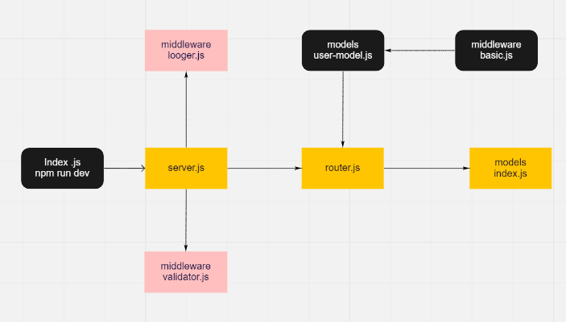

# basic-auth
## Author: Essam Omar

## Setup
- .env
- PORT = 8000

## Running the app
- npm run dev

## Tests
- npm run test

## Deployment Test :
- Heroku: https://essam-basic-auth.herokuapp.com/
- Github : https://github.com/essamomar93/basic-auth
- last pull request : https://github.com/essamomar93/basic-auth/pull/3

## Languages :
- javascript

## UML :

